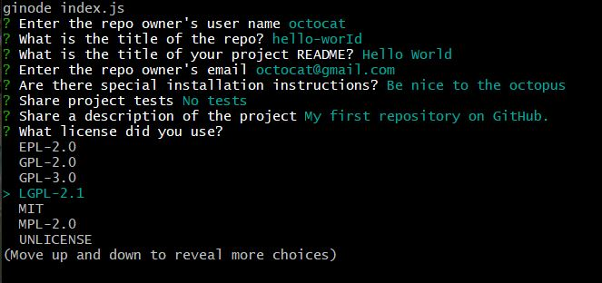

# Professional README Generator 

## Description:

&nbsp; When creating an open source project on GitHub, it’s important to have a high-quality README for the app. This should include what the app is for, how to use the app, how to install it, how to report issues, and how to make contributions—this last part increases the likelihood that other developers will contribute to the success of the project.

&nbsp; With this Professional README Generator you can quickly and easily generate a README file by using a command-line application to generate one. This allows the project creator to devote more time working on the project.

## User Story

&nbsp; AS A developer
&nbsp; I WANT a README generator
&nbsp; SO THAT I can quickly create a professional README for a new project

## Table of Contents:

- [Installation](#installation)
- [Usage](#usage)
- [Tests](#tests)
- [Badges](#badges)
- [How_to_Contribute](#how_to_contribute)
- [Questions](#questions)
- [License](#license)

## Installation:

&nbsp; None

## Usage:

&nbsp; Visit this link for a demo: https://youtu.be/dklyVLiek8M

&nbsp; user must enter 'node index.js' in the respsective local director folder when accessing this command-line application that accepts user input. They are then prompted for information about the application repository. When completed, a high-quality, professional README.md is generated on the desktop with the title of my project and sections entitled Description, Table of Contents, Installation, Usage, License, Contributing, Tests, and Questions. The user may make adjustments to the markdown file as needed.

&nbsp; The website can be found at: https://arishorts.github.io/readmegenerator/

## Tests:

&nbsp; N/A

## Badges:

## How_to_Contribute:

&nbsp; If you would like to contribute, refer to the [Contributor Covenant](https://www.contributor-covenant.org/)

## Questions:

&nbsp; My GitHub profile can be found at: https://github.com/arishorts
 &nbsp; Reach me with additional questions at : arieljschwartz@gmail.com

## License:

&nbsp; http://choosealicense.com/licenses/mit/

---

© 2022 Ariel Schwartz LLC. Confidential and Proprietary. All Rights Reserved.
